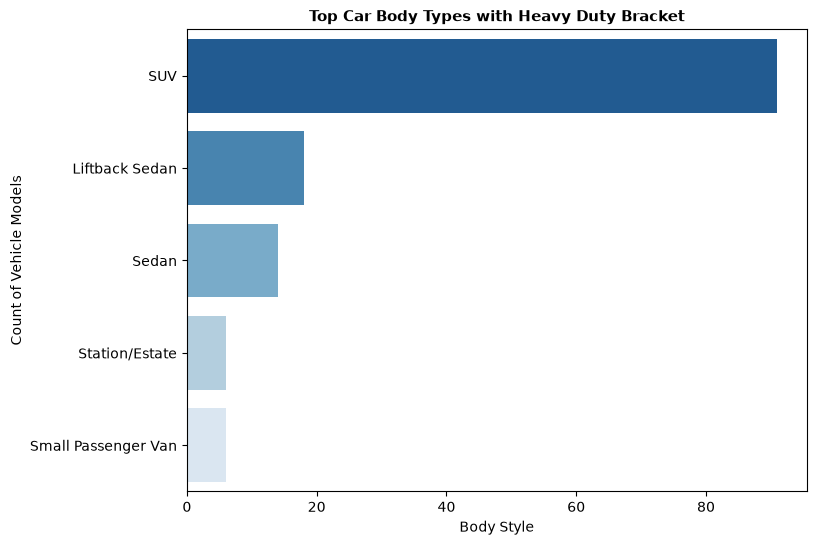
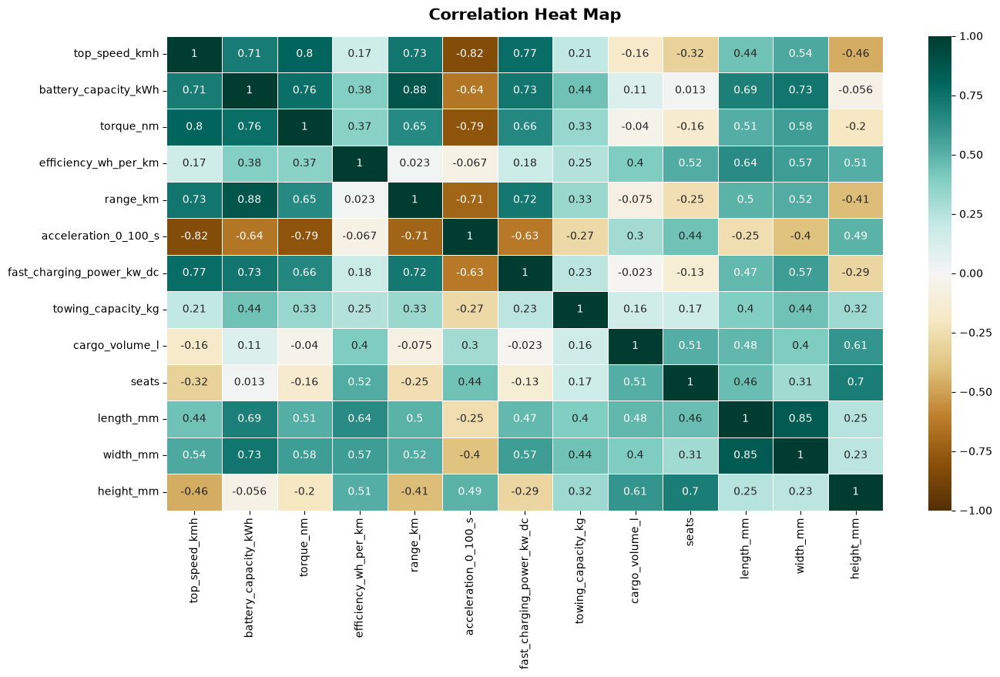

# EV-Powertrain-Analytics: Real-World EV Market Dynamics & Dimensional Scaling

## 🚀 Project Overview
This repository contains an end-to-end Exploratory Data Analysis (EDA) dashboard investigating modern Electric Vehicle (EV) technical specifications, mechanical drivetrain layouts, and platform architecture configurations. 

Rather than treating the dataset as a static mathematical array, this analysis bridges **Data Science methodologies with Automotive Engineering principles** to reveal how battery pack mass scaling introduces physical trade-offs in fleet-wide energy efficiencies.

## 🛠️ Tech Stack & Analytical Core
* **Core Analytics:** Python, Pandas, NumPy
* **Data Visualization:** Matplotlib, Seaborn
* **Statistical Methods:** Grouped Aggregation, Bivariate Density Distributions, Pearson Feature Inter-Correlation Matrices

---

## 💡 Key Architectural Insights Exposed

### 1. The Power-to-Mass Efficiency Paradox (Jevons Paradox)
Bivariate scatter modeling of `battery_capacity_range` against `range_km` reveals clear non-linear diminishing returns. While expanding battery capacity structurally expands maximum travel ranges, the linear progression flattens at upper tiers due to the exponential deadweight penalty of heavy cell configurations.

### 2. Drivetrain Architecture vs. Performance Dynamics
Through distribution stratifications, the data mathematically validates that All-Wheel Drive (AWD) multi-motor layouts systematically clear traction-limit thresholds. AWD architectures yield significantly tighter, lower $0\text{-}100\text{ km/h}$ acceleration profiles compared to single-motor FWD alternatives due to instant electronic torque vectoring.

### 3. Progressive Dimensional Scaling
Horizontal boxplot analysis sorted by median dimensional features (`length_mm`) exposes a pristine, ascending stair-step progression across traditional vehicle classifications—confirming that standardized market segments tightly mirror physical platform footprint boundaries.

---

## 📊 Sample Visualizations
*(Below are examples of structural feature tracking plots generated during EDA)*

| Structural Dimensionality Matrix | Parametric Feature Interactions |
| :---: | :---: |
|  |  |

---

## 🗂️ Notebook Analysis Architecture
The master portfolio notebook (`ev_spec_analyzer.ipynb`) is modularly engineered into three high-impact sections:
1. **Section 1: Fleet Electrification & Market Benchmarking** — Evaluating manufacturer market shares, fleet-wide mean energy consumption ($Wh/km$), and brand range boundaries.
2. **Section 2: Drivetrain Dynamics & Mass Classifications** — Validating multi-motor acceleration velocity profiles and heavy-duty towing chassis constraints.
3. **Section 3: Dimensional Scalability & Feature Interactions** — Probability density modeling of velocity limits via Kernel Density Estimates (KDE) and system-wide correlation maps.
